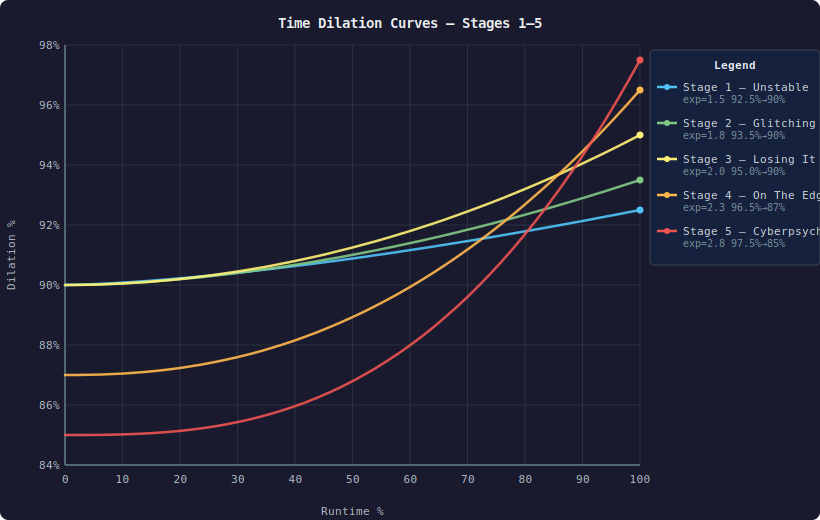
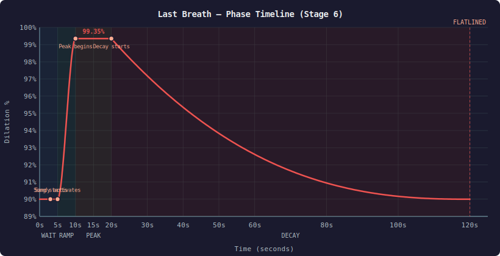
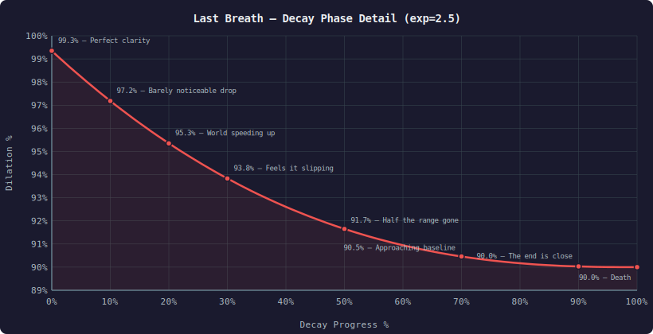

# Time Dilation Curves — Technical Reference

How the Sandevistan's time dilation degrades as runtime depletes, per cyberpsychosis stage.

## Concepts

- **timeScale** — Engine value where `0.10` = 90% dilation (world runs at 10% speed), `0.0065` = 99.35%
- **Dilation %** — `(1 - timeScale) * 100`. Higher = faster Sandy = more strain on V
- **maxTS** — timeScale at full runtime (peak dilation)
- **minTS** — timeScale at zero runtime (degraded dilation)
- **rtRatio** — `runTime / MaxRunTime` (1.0 = full, 0.0 = empty)
- **exp** — Curve exponent. Higher = dilation drops faster from peak

## Formula

```
timeScale = minTS + (maxTS - minTS) * rtRatio^exp
```

- `exp = 1.0` — Linear (constant degradation rate)
- `exp > 1.0` — Concave (fast drop from peak, slow approach to minimum)
- Higher psycho stage → higher exponent → shorter time at peak dilation

## Stage Parameters

| Stage | Name | maxTS | minTS | Dilation Range | exp | Character |
|-------|------|-------|-------|----------------|-----|-----------|
| 0 | Normal | 0.10 | — | 90% (fixed) | — | Base config value, no curve |
| 1 | Unstable | 0.075 | 0.10 | 92.5% → 90% | 1.5 | Subtle, almost linear |
| 2 | Glitching | 0.065 | 0.10 | 93.5% → 90% | 1.8 | Slight acceleration |
| 3 | Losing It | 0.05 | 0.10 | 95% → 90% | 2.0 | Quadratic — noticeable drop |
| 4 | On The Edge | 0.035 | 0.13 | 96.5% → 87% | 2.3 | Aggressive — peak fades fast |
| 5 | Cyberpsycho | 0.025 | 0.15 | 97.5% → 85% | 2.8 | Very aggressive — brief peak |
| 6 | Last Breath | special | 0.10 | 99.35% → 90% | ~2.5 | Multi-phase (see below) |

## Curve Visualizations

All five runtime-based stages overlaid for comparison. Higher psycho stages produce steeper curves — the peak dilation is more extreme but fades faster.



## Stage 6 — Last Breath (Multi-Phase)

Last Breath uses a time-based curve (elapsed seconds), not runtime ratio. This represents David's final moment — a brief spike of perfect clarity before the inevitable collapse.

### Phase Timeline



### Phase Details

| Phase | Time | Dilation | Description |
|-------|------|----------|-------------|
| **Wait** | 0–5s | 90% (base) | V revives. Song starts at 3s. No Sandy yet |
| **Ramp** | 5–10s | 90% → 99.35% | Sandy activates, dilation climbs to peak |
| **Peak** | 10–20s | 99.35% | Maximum clarity — David's perfect moment |
| **Decay** | 20s+ | 99.35% → 90% | Exponential decay (exp ~2.5), fast initial drop |
| **Death** | runtime=0 | ~90% | "THE MOON... I CAN SEE IT" → FLATLINED |

### Decay Phase Formula

```
elapsed = time since decay started
decayDuration = total remaining runtime at decay start
progress = elapsed / decayDuration
timeScale = 0.10 + (0.0065 - 0.10) * (1 - progress)^2.5
```

The `(1 - progress)^2.5` creates the exponential decay: dilation drops quickly from 99.35% in the first seconds, then slows as it approaches 90% — V's last sensation fading gradually.

### Dilation Milestones During Decay



## Lore Context

The curve design follows David Martinez's arc in Edgerunners:

- **Stages 1–3**: The Sandy works well. Degradation is subtle — David barely feels it
- **Stage 4**: The body fights back. Peak performance fades quickly, like David's nosebleeds
- **Stage 5**: V's body is failing. The 97.5% flash is David pushing through despite everything
- **Stage 6**: The final stand — see **[last-breath.md](last-breath.md)** for the full song-synced timeline, effect graphs, and implementation details
