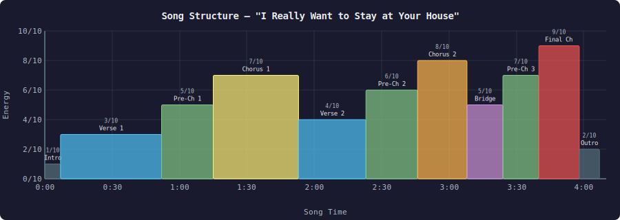
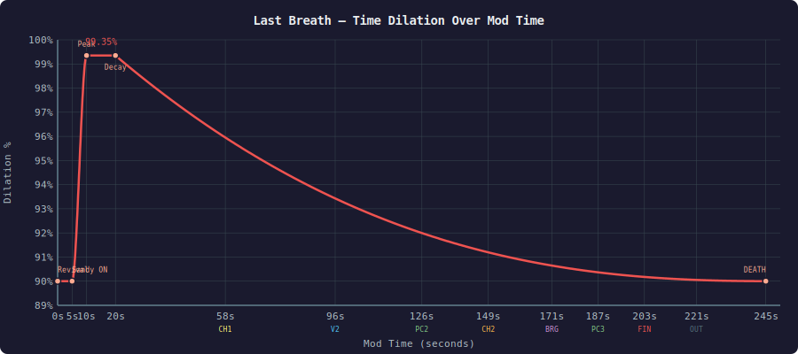
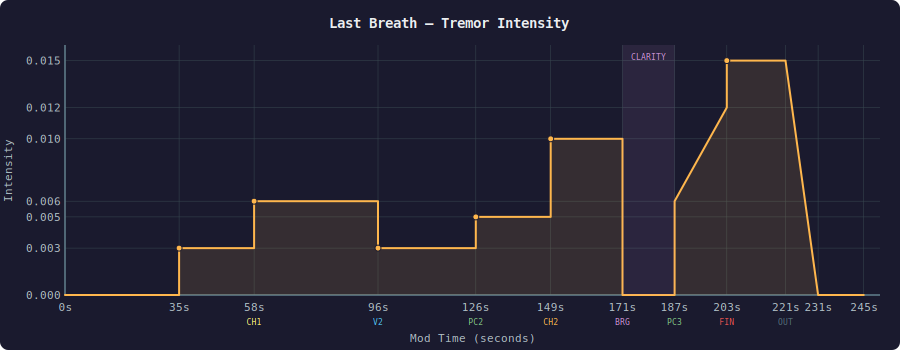
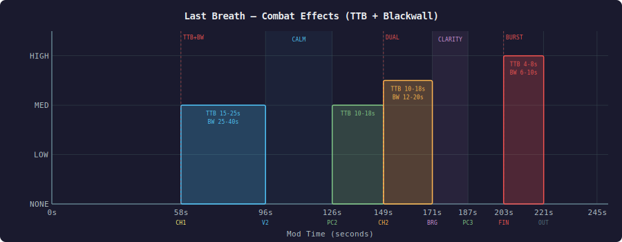
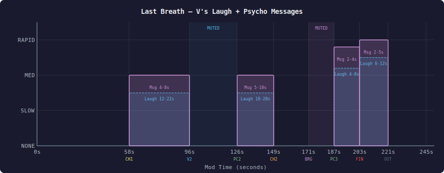
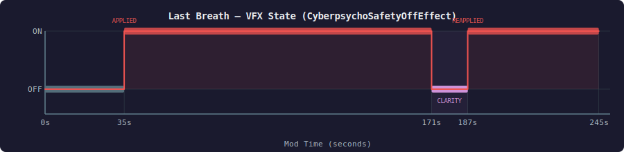
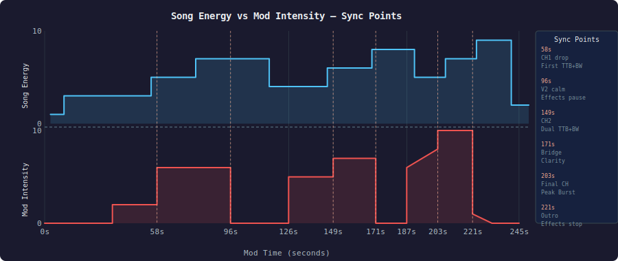

# Last Breath (Stage VI) — Technical Reference

David's final stand. Triggered when V dies at psycho level 5 and Second Heart revives them. A one-way trip — there is no recovery from Stage VI.

## Trigger

```
V at psycho level 5 → health reaches 0 (Neural Strain episode or combat damage)
  → KillV() → HeartAttack status effect → cheatedDeath = true
  → Second Heart fires (revives V)
  → RemoveDeadV() detects cheatedDeath → Last Breath initializes
```

## Song Reference

**"I Really Want to Stay at Your House"** — Rosa Walton (feat. Hallie Coggins)

| Property | Value |
|----------|-------|
| Duration | ~4:05 (245s) |
| BPM | 124–125 |
| Key | F# Major / D#m |
| Character | Melancholic synth-pop — upbeat production masking deep sadness |

### Song Structure



## Complete Timeline

Three columns: mod time (from RemoveDeadV), song time, and what happens.

```
MOD     SONG     PHASE            WHAT HAPPENS
TIME    TIME
─────── ──────── ──────────────── ────────────────────────────────────────────────

                  ┌─────────────────────────────────────────────────────────────┐
                  │                    PEACE PHASE (20s)                        │
                  └─────────────────────────────────────────────────────────────┘

  0s     —       REVIVAL          V revives from Second Heart
                                  RemoveDeadV() fires:
                                  ├─ ALL VFX removed (psycho, safety off, bleeding)
                                  ├─ Tremor = 0, heartbeat stopped, laughs stopped
                                  ├─ isRunning = false (Sandy NOT active)
                                  ├─ SafetyOn = false
                                  ├─ Runtime set to max(current, 245s)
                                  └─ "CYBERPSYCHOSIS VI — UNCLASSIFIED — LAST BREATH"

  3s     0:00    SONG STARTS      PlayLastBreathSong() → Audioware (affectedByTimeDilation=false)
                                  Intro: soft synth pad, ethereal
                                  Dilation: 90% (base, no Sandy)

  5s     0:02    SANDY ON         isRunning = true
                                  SetIgnoreTimeDilationOnLocalPlayerZero(true)
                                  RAMP begins: 90% → 99.35% over 5 seconds
                                  ├─ 5s  → 90.0%  (timeScale 0.100)
                                  ├─ 6s  → 91.9%  (timeScale 0.081)
                                  ├─ 7s  → 93.7%  (timeScale 0.063)
                                  ├─ 8s  → 95.6%  (timeScale 0.044)
                                  ├─ 9s  → 97.5%  (timeScale 0.025)
                                  └─ 10s → 99.35% (timeScale 0.0065)

 10s     0:07    PEAK             Verse 1 vocals enter in the song
                                  Dilation locked at 99.35% for 10 seconds
                                  World nearly frozen — perfect clarity

 20s     0:17    DECAY STARTS     phase = "decay", elapsed resets to 0
                                  Runtime: ~230s remaining (15s consumed in peace)

                  ┌─────────────────────────────────────────────────────────────┐
                  │                    DECAY PHASE (~225s)                      │
                  │          (all times below are decay elapsed)                │
                  └─────────────────────────────────────────────────────────────┘

                  ┈┈┈┈┈┈ SONG: VERSE 1 (calm, intimate) ┈┈┈┈┈┈

  +0s    0:17    IMMUNITY         Health floor at 25%, no combat effects
                                  Dilation: 99.35% → degrading via exp 2.5 curve
                                  Tremor: 0 (silence)

 +31s    0:48    IMMUNITY OFF     "IMMUNITY FADING"
                                  V can now take lethal damage

                  ┈┈┈┈┈┈ SONG: PRE-CHORUS 1 (energy builds) ┈┈┈┈┈┈

 +35s    0:52    VFX START        CyberpsychoSafetyOffEffect applied
                                  "NEURAL COLLAPSE IMMINENT"
                                  Tremor: 0.003 (subtle)

                  ┈┈┈┈┈┈ SONG: CHORUS 1 (beat drops!) ┈┈┈┈┈┈

 +58s    1:15    ★ CHORUS 1       FIRST combat effects fire:
                  DROP             ├─ TickingTimeBomb() (EMP wave from V, staggered 20m)
                                  ├─ BlackwallKill in 2s (Blackwall corruption, 25m)
                                  ├─ Tremor: 0.006
                                  ├─ PsychoMessages start (4-8s intervals)
                                  ├─ V laughs start (12-22s intervals)
                                  └─ "SYSTEM OVERLOAD"

+58-96s  1:15-53 CHORUS 1         Active combat window:
                  (active)        ├─ TTB every 15-25s
                                  └─ Blackwall every 25-40s

                  ┈┈┈┈┈┈ SONG: VERSE 2 (strips back, breathing room) ┈┈┈┈┈┈

 +96s    1:53    VERSE 2          ★ CALM — all combat effects pause:
                  (calm)          ├─ Tremor drops to 0.003
                                  ├─ No TTB / Blackwall
                                  ├─ No PsychoMessages
                                  └─ No V laughs
                                  (Song: raw vocals, pain awareness)

                  ┈┈┈┈┈┈ SONG: PRE-CHORUS 2 (tension rebuilds) ┈┈┈┈┈┈

+126s    2:23    PRE-CHORUS 2     Effects resume:
                                  ├─ TTB resumes (10-18s intervals)
                                  ├─ Tremor: 0.005
                                  ├─ PsychoMessages restart (5-10s)
                                  └─ V laughs restart (10-20s)

                  ┈┈┈┈┈┈ SONG: CHORUS 2 (full production) ┈┈┈┈┈┈

+149s    2:46    ★ CHORUS 2       Dual strike:
                                  ├─ Forced TTB + Blackwall (simultaneous)
                                  ├─ Tremor: 0.010
                                  ├─ Blackwall every 12-20s
                                  └─ "NEURAL CASCADE ACCELERATING"

+149-171 2:46-08 CHORUS 2         Active combat window (intense):
                  (active)        ├─ TTB continues (10-18s)
                                  └─ Blackwall every 12-20s

                  ┈┈┈┈┈┈ SONG: BRIDGE (exposed, vulnerable) ┈┈┈┈┈┈

+171s    3:08    ★★ BRIDGE        *** MOMENT OF CLARITY ***
                                  EVERYTHING stripped:
                                  ├─ ALL VFX removed
                                  ├─ CyberpsychoSafetyOffEffect removed
                                  ├─ Tremor: 0 (still hands)
                                  ├─ No TTB / Blackwall
                                  ├─ No PsychoMessages
                                  ├─ No V laughs
                                  └─ "..."
                                  (Song: "Oh oh oh, I don't know why I'm no-one")
                                  (David snaps out — one last moment of self)

                  ┈┈┈┈┈┈ SONG: PRE-CHORUS 3 (final emotional build) ┈┈┈┈┈┈

+187s    3:24    PRE-CHORUS 3     VFX return with force:
                  (final build)   ├─ CyberpsychoSafetyOffEffect re-applied
                                  ├─ Tremor: 0.006 → building to 0.012
                                  ├─ Fast PsychoMessages (2-4s intervals)
                                  ├─ Frequent V laughs (4-8s intervals)
                                  └─ "NO... NOT YET..."

                  ┈┈┈┈┈┈ SONG: FINAL CHORUS (climax — maximum intensity) ┈┈┈┈┈┈

+203s    3:40    ★★★ FINAL        PEAK BURST — everything converges:
                  CHORUS          ├─ Forced TTB + Blackwall
                                  ├─ Tremor: 0.015 (MAXIMUM)
                                  ├─ Rapid TTB (every 4-8s)
                                  ├─ Rapid Blackwall (every 6-10s)
                                  └─ "NEURAL CASCADE — CRITICAL OVERLOAD"

+203-221 3:40-58 FINAL CHORUS     Maximum intensity combat window:
                  (active)        ├─ TTB every 4-8s
                                  ├─ Blackwall every 6-10s
                                  └─ Tremor locked at 0.015

                  ┈┈┈┈┈┈ SONG: OUTRO (rapid fadeout) ┈┈┈┈┈┈

+221s    3:58    OUTRO            Effects stop:
                                  ├─ No more TTB / Blackwall
                                  ├─ No more laughs / messages
                                  └─ Tremor fades: 0.015 → 0 over 10s

+230s    4:07    SONG ENDS        Tremor near 0, approaching death
                                  Dilation near 90% (floor)

                  ┌─────────────────────────────────────────────────────────────┐
                  │                         DEATH                              │
                  └─────────────────────────────────────────────────────────────┘

~+225s   —       RUNTIME = 0      Song stopped, time restored
                                  All VFX removed
                                  "THE MOON... I CAN SEE IT"
                                  Terminal clarity: 3s (all effects cleared)

~+228s   —       FLATLINED        "DAVID MARTINEZ — FLATLINED"
                                  Permanent death — no revival
```

## Effect Timelines (Individual)

### Time Dilation



Formula: `timeScale = 0.10 + (0.0065 - 0.10) * rtRatio^2.5` — Runtime drains 1:1 (no Safety Off multiplier during Last Breath)

### Tremor Intensity



### Combat Effects (TTB + Blackwall)



Forced events: +58s (Chorus 1 drop), +149s (Chorus 2 drop), +203s (Final Chorus peak burst) — all trigger simultaneous TTB + Blackwall.

### V's Laugh + Psycho Messages



Message pool (Stage 6): Lucy, the Moon, confused identity, fragmented thoughts — *"Lucy... are you there?"*, *"I can see the moon from here"*, *"Who... who am I?"*, *"Just a little further... almost there"*

### VFX (CyberpsychoSafetyOffEffect)



Applied effect contains: glitch + braindance + drugged + blackwall VFX.

## Song ↔ Mod Emotional Arc



## Configuration

| Parameter | Value | Location |
|-----------|-------|----------|
| `lastBreathPeaceTime` | 20s | init.lua — 5s wait + 5s ramp + 10s peak |
| `lastBreathRuntime` | 245s | init.lua — matches song duration (4:05) |
| `lastBreathSong` | `n"dsp_last_breath_song"` | DSPHUDSystem.reds — Audioware event via AudioSystemExt |
| Dilation peak | 99.35% (0.0065) | Peace ramp target + decay start |
| Dilation floor | 90% (0.10) | Decay minimum (exp 2.5 curve) |
| Runtime drain | 1:1 | No Safety Off multiplier during Last Breath |

## Implementation Files

| File | What |
|------|------|
| `init.lua` — `RemoveDeadV()` | Last Breath initialization, state flags |
| `init.lua` — `UpdateLastBreath()` | Per-frame update: peace ramp, song-synced decay |
| `init.lua` — `TimeDilationCalculator()` | Dilation curve for peace (ramp) and decay (exp 2.5) |
| `init.lua` — `PlayLastBreathSong()` | Calls hud bridge → DSPHUDSystem → Audioware AudioSystemExt |
| `init.lua` — `TickingTimeBomb()` | EMP wave from V: staggered stun by distance (0-7m/7-14m/14-20m) |
| `init.lua` — `BlackwallKill()` | Blackwall corruption kill: EP1 HauntedBlackwallForceKill with fallback (25m) |
| `hud.lua` | "[VI] LAST BREATH" display, pulsing red during decay, audio bridge |
| `martinez.lua` | CyberpsychoSafetyOffEffect, PsychoLaughEffect TweakDB records |
| `DSPHUDSystem.reds` — `PlayLastBreathSong()` | Audioware playback with `affectedByTimeDilation = false` + 2s fade-in |
| `DSPHUDSystem.reds` — `StopLastBreathSong()` | Audioware stop with 3s fade-out |
| `r6/audioware/DavidSandevistanPlus/` | Audioware manifest + `last_breath_song.ogg` |
