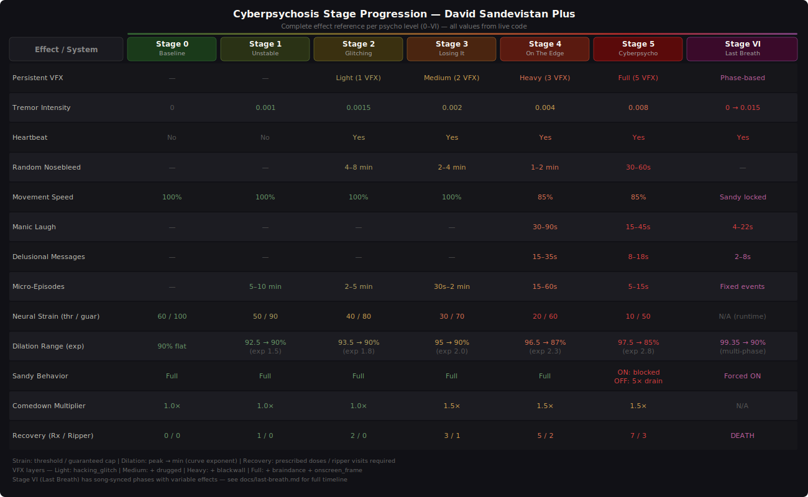

# Lore-Accurate Gameplay Systems — Technical Reference

Eight interconnected systems implementing physical, unpredictable, and cumulative deterioration inspired by David Martinez's arc in Edgerunners.

### Stage Progression Matrix



## Design Philosophy

In the anime, David's deterioration was:
- **Physical** — stat penalties, not just visual effects
- **Unpredictable** — symptoms struck without warning
- **Cumulative** — each use made the next one worse
- **Gradual** — recovery took time, not a single sleep

These systems implement that philosophy. All are toggleable via cfg flags and configurable through the MartinezPLUS Settings UI.

## System 1: Neural Strain (Episode Trigger)

An accumulation pool + dice roll system. Episodes are unpredictable and cumulative — matching David's lore deterioration.

### How It Works

```
NEURAL STRAIN (0 → guaranteed per stage)

Tolerance-based strain (scaled by stage multiplier):
  Sandy activation    → +5 (+ overuse bonus)
  Sandy active /60s   → +2
  Stage multiplier:   Stage 0-1: ×0.5, Stage 2: ×0.75, Stage 3-5: ×1.0

Psychological/physical strain (raw — bypasses stage multiplier):
  Safety OFF /sec     → +0.15
  Kill during Sandy   → +2 to +8 (faction-based, configurable per faction)
  Low runtime (<10%)  → +0.5/s
  Zero runtime        → +1.0/s

Actions reduce strain:
  Safe area /sec      → -0.05
  Sleep               → -40 (scaled by hours)
  Ripperdoc           → -25
  Immunoblocker /sec  → -0.08/0.18/0.35 per tier (reduces accumulation 80% full, 50% partial)
  DF Immunosup. /sec  → -0.08

When strain >= threshold → dice roll each second:
  chance = (strain - threshold) / 200
  Success → EPISODE (MartinezFury, psycho++) + strain reset to 0
  At guaranteed → forced episode (can't avoid)
```

### Strain Multiplier Separation

`AddStrain(amount, raw)` accepts a `raw` parameter:

- `raw = false` (default): Applies the stage-based strain multiplier. Used for tolerance-based strain (Sandy activation, overuse bonus, active time). At low stages the body resists more, making it harder to trigger episodes from normal use.
- `raw = true`: Bypasses the stage multiplier entirely. Used for psychological/physical strain (kills, low/zero runtime, Safety OFF). The trauma of killing and physical stress of pushing past limits hit equally hard regardless of stage.

| Stage | Multiplier | Tolerance Strain Impact |
|-------|-----------|------------------------|
| 0 | x0.5 | Half impact -- body is fresh |
| 1 | x0.5 | Half impact -- still resilient |
| 2 | x0.75 | Reduced but noticeable |
| 3 | x1.0 | Full impact |
| 4 | x1.0 | Full impact |
| 5 | x1.0 | Full impact |

### Kill Strain (Redscript Hook)

`DSPKillTracker.reds` wraps `ScriptedPuppet.RewardKiller()` via `@wrapMethod` to intercept kills:

| Faction | Strain Cost | Lore |
|---------|-------------|------|
| Civilian / Unaffiliated | 8 | David never wanted to hurt civilians |
| NCPD / NetWatch | 5 | Killing cops accelerates psychosis |
| Arasaka / Militech / KangTao | 3 | Corporate security |
| All gangs | 2 | Normal enemies |

Per-faction strain values are configurable. Kill strain routes through `DSPHUDSystem.AddKillStrain(cost)` using a packed Int32 encoding (gang/corpo/ncpd/civilian values packed into a single integer) → CET Lua reads via `GetAndClearKillStrain()` each tick.

### Thresholds Per Stage

| Stage | Threshold | Guaranteed | Experience |
|---|---|---|---|
| 0 | 60 | 100 | Hard to trigger — highest thresholds, but overuse escalates to stage 1 |
| 1 | 50 | 90 | Manageable with care |
| 2 | 40 | 80 | Casual overuse is dangerous |
| 3 | 30 | 70 | Almost any aggressive session triggers |
| 4 | 20 | 60 | Constant danger |
| 5 | 10 | 50 | Near-inevitable — Last Breath territory |

### Design Decision: No Auto-Level-Decrease

Level decreases ONLY via:
- Sleep (prescription system: -1 level per rest)
- Ripperdoc (prescription system: -1 level per visit)

Strain reaching 0 means "safe within current level" but doesn't reduce the level. This cleanly separates: **strain = episode risk within a level**, **psycho level = overall progression**.

### Persistence

`neuralStrain` saved/loaded via quest fact `martinezsandevistan_neuralstrain` (×10+1 encoding for 0.1 resolution). Kill strain is transient (lost on load).

## System 2: Immunoblocker (Consumable Item)

Doc's prescribed medication — *"Nine times your customary dosage."* A consumable item purchasable from dedicated VendorsXL vendors.

### Item Tiers

| Tier | In-Game Name | Quality | Duration | Price | Drain Rate |
|------|-------------|---------|----------|-------|------------|
| Rare | Immunoblocker | Rare (blue) | 180s (3 min) | 6,000€$ | 0.08/s (14.4 total) |
| Epic | Immunoblocker — High Dosage | Epic (purple) | 360s (6 min) | 24,000€$ | 0.18/s (64.8 total) |
| Legendary | Military-Grade Immunoblocker | Legendary (gold) | 600s (10 min) | 100,000€$ | 0.35/s (210 total) |

Each tier has a custom inventory icon (separate inkatlas+xbm per tier).

### TweakDB Records (martinez.lua)

Each tier creates:
- **StatusEffect**: `BaseStatusEffect.MartinezSandevistan_ImmunoblockerCommon/Uncommon/Rare` — timed, tagged `Immunoblocker`, no stat packages (detection-only via `StatusEffect_CheckOnly()`)
- **ConsumableItem**: `Items.MartinezImmunoblockerCommon/Uncommon/Rare` — `ItemType.Con_LongLasting`, custom icon via `UIIcon.Immunoblocker_Common/Uncommon/Rare`
- **ObjectActionEffect** + **ItemAction**: bridge records for the consume action
- **Price override**: `.buyPrice` set with custom `ConstantStatModifier` (overrides inherited HealthBooster pricing)
- **Stat cleanup**: `.statModifiers`, `.OnEquip` cleared to remove inherited HealthBooster stats; `.statModifierGroups` keeps only `Items.LongLastingConsumableDuration` for tooltip duration

### Vendors

Immunoblockers are sold exclusively through VendorsXL custom vendors at two locations:

| Location | Vendor |
|----------|--------|
| Arroyo | VendorsXL vendor NPC |
| Kabuki | VendorsXL vendor NPC |

VendorsXL is the only way to create interactive vendor NPCs that work with the game's native `MarketSystem`. Ripperdoc TRADE tabs are not used.

### Effects While Active

- **Reduces strain accumulation**: 80% when full effectiveness, 50% when partial (not 100% — V still feels it)
- **Drains strain** at tier-specific rates: 0.08/s (Common), 0.18/s (Uncommon), 0.35/s (Rare)
- **Ineffective mode**: 0% accumulation reduction, only 25% of tier drain rate
- **Suppresses micro-episodes** (full/partial only)
- **Counts as prescription dose**

### Effectiveness by Psycho Level

| Tier | Full | Partial | Ineffective |
|------|------|---------|-------------|
| Common | Lvl 0–1 | Lvl 2 | Lvl 3–5 |
| Uncommon | Lvl 0–2 | Lvl 3 | Lvl 4–5 |
| Rare | Lvl 0–5 | Never | Never |

### DF Immunosuppressant Comparison

| | Immunoblocker | DF Immunosuppressant |
|---|---|---|
| Reduces accumulation | 80% (full) / 50% (partial) | No |
| Drain rate | 0.08–0.35/s (per tier) | -0.08/s |
| Suppresses micro-episodes | Yes (full/partial) | Yes |
| Source | VendorsXL vendors (Arroyo + Kabuki) | Dark Future mod |

Both can be active simultaneously without conflict.

### Custom Injection Animation

Immunoblockers use a custom syringe injection scene (`drug_inhale_01`) with timed audio, VFX, and voiceover events. The vanilla HealthBooster animation is suppressed via a redscript `ProcessItemAction` wrapper.

Timeline (~1.9s total):

| Time | Event | Type |
|------|-------|------|
| 0ms | `drug_inhale_01` animation + `lcm_mvs_canvas_fast_light` audio + `inhale_drug_exhale` VFX | Anim/Audio/VFX |
| 10ms | Attach syringe prop → WeaponLeft slot | System |
| 300ms | `cmn_generic_work_inject_drug` — needle enters | Audio |
| 380ms | `ono_v_pain_short` — pain reflex | Voiceover |
| 450ms | `reflex_buster` — vision doubling | VFX |
| 500ms | `skif_buff` — buff flash | VFX |
| 1550ms | `lcm_mvs_canvas_fast_light` — transition audio | Audio |
| 1600ms | `ono_v_laughs_hard` — relief/euphoria | Voiceover |
| 1909ms | `socket OnEnd` — animation complete | System |



## System 3: Runtime-Based Penalties

The Sandevistan's physical toll scales with remaining runtime. V can always reactivate — there is no cooldown or reactivation block (lore-accurate: David never had a cooldown). Instead, pushing through low runtime carries escalating penalties.

### Penalty Tiers

| Runtime | Stamina | Speed | Armor | Tremor | Strain/s | Experience |
|---------|---------|-------|-------|--------|----------|------------|
| >30% | ×1.5 | — | — | — | — | Body energized by Sandy |
| 10–30% | Normal | — | — | 0.003 | +0.15/s | Nosebleed on activation |
| <10% | ×0.5 | ×0.6 | ×0.5 | 0.006 | +0.5/s | Heavy physical distress |
| 0% | — | — | — | — | +1.0/s | Death wish territory |

### MaxRuntime Scaling by Stage

Each psycho stage reduces the effective maximum runtime:

| Stage | MaxRuntime | Example (120s base) |
|-------|-----------|---------------------|
| 0 | 100% | 120s |
| 1 | 90% | 108s |
| 2 | 80% | 96s |
| 3 | 65% | 78s |
| 4 | 50% | 60s |
| 5 | 35% | 42s |

### Behavior

- No reactivation block — V can always fire the Sandy regardless of runtime
- Stamina bonus (×1.5) at high runtime reflects the Sandy energizing the body
- Low runtime tremor and nosebleed provide visceral feedback before stat penalties hit
- Zero runtime strain accumulation (+1.0/s) makes staying active at empty runtime extremely dangerous
- Penalties are evaluated continuously during Sandy use

## System 4: Doc Prescription (Graduated Recovery)

Recovery is a process, not an instant cure. Each psycho level requires a specific number of treatment "doses" to clear.

### Prescription Table

| Psycho Level | Required Doses | Min Ripper Visits | Sleep Can Cure? |
|---|---|---|---|
| 0 | 0 | 0 | — |
| 1 | 1 | 0 | Yes (1 sleep) |
| 2 | 2 | 0 | Yes (2 sleeps) |
| 3 | 3 | 1 | No — needs 1 visit + 2 sleeps |
| 4 | 5 | 2 | No — needs 2 visits + 3 sleeps |
| 5 | 7 | 3 | No — can't go below 4 without ripper |

### Recovery Mechanics

**Sleep (`Rested()`):**
- Max -1 psycho level per sleep (configurable via `maxPsychoRecoveryPerSleep`)
- Counts as 1 treatment dose toward prescription
- Level 5 can only drop to 4 via sleep — ripper required to go lower
- Resets `sessionActivations`
- Recovers 75% of degraded max runtime (`sleepRecoveryPercent`)

**Ripperdoc (`VisitedRipper()`):**
- Issues prescription on first visit (sets `prescribedDoses`)
- Each visit = 1 treatment dose + -1 psycho level
- Grants 50% max runtime recharge
- Fully restores degraded max runtime (`ripperFullRestore`)

**Dark Future Immunosuppressant:**
- 60s of active immunosuppressant = 0.5 treatment dose

### HUD Display

`SetPsychoData()` takes 4 params:
```redscript
SetPsychoData(psychoLevel, lastBreathPhase, prescribedDoses, completedDoses)
```

New `SetStrainData()` for Neural Strain bar:
```redscript
SetStrainData(neuralStrain, strainThreshold, strainGuaranteed, immunoblockerActive)
```

Displays `RX 2/5` next to psycho level when prescription is active.
Strain bar shows `STRAIN 45/60` with blue→yellow→red color coding. The strain bar and icon are visible at all stages, including stage 0.

### Persistence

`prescribedDoses` and `completedDoses` saved/loaded via quest facts (existing pattern).

## System 5: Non-Linear Runtime Drain

Four sub-systems that make sustained Sandevistan use increasingly costly.

### 5a: Dilation Cap by Stage

The psycho curve acts as a **cap** on maximum dilation, not a boost. Each stage limits how much time dilation V can achieve, regardless of perk or cyberware bonuses:

| Stage | maxTS | minTS | Dilation Cap |
|-------|-------|-------|-------------|
| 0 | 0.10 | 0.10 | 90% (fixed) |
| 1 | 0.10 | 0.08 | 90–92% |
| 2 | 0.08 | 0.06 | 92–94% |
| 3 | 0.06 | 0.04 | 94–96% |
| 4 | 0.04 | 0.02 | 96–98% |
| 5 | 0.02 | 0.01 | 98–99% |

Stage 0 is a hard cap at 90% regardless of the Sandy's native timeScale. Higher stages unlock progressively more extreme dilation — greater power at the cost of accelerating psychosis.

### 5b: Accelerating Drain

Drain accelerates the longer V stays in dilation:

```lua
drainRate = 1.0
if enableNonLinearDrain and not lastBreath then
    activeSeconds = sandyStartRuntime - runTime
    if activeSeconds > drainAccelStartSec then
        overTime = (activeSeconds - drainAccelStartSec) / 60
        drainRate = 1.0 + overTime ^ drainExponent
    end
end
runTime -= dt * drainRate
```

| Active Time | Drain Rate | Effective Drain |
|---|---|---|
| 0–60s | 1.0× | Normal |
| 90s | 1.2× | Slight acceleration |
| 120s | 2.0× | Double drain |
| 180s | 3.8× | Nearly 4× drain |
| 240s | 6.2× | Brutally expensive |

### 5c: Session Fatigue

Each Sandy activation past the safe daily limit reduces dilation effectiveness:

```lua
excessUses = max(0, sessionActivations - effectiveSafeActivations)
penalty = min(excessUses * sessionFatiguePenalty, maxSessionFatiguePenalty)
timeScale += penalty  -- higher timeScale = less dilation
```

| Excess Uses | Penalty | Effective Dilation (from 90% base) |
|---|---|---|
| 0 | 0% | 90.0% |
| 3 | -6% | 84.0% |
| 5 | -10% (cap) | 80.0% |

Resets on sleep.

### 5d: Max Runtime Degradation

Each Sandy session permanently reduces max runtime:

```
degradation = (runtimeUsed / 60) * 0.01 * MaxRuntime
maxRuntimeDegraded += degradation  (capped at 0.5 * MaxRuntime)
effectiveMaxRuntime = MaxRuntime - maxRuntimeDegraded
```

| Recovery | Amount |
|----------|--------|
| Sleep | 75% of degraded amount restored |
| Ripperdoc | 100% restored (full max runtime) |

Helper: `GetEffectiveMaxRuntime()` used in `Rested()` and runtime calculations.

## System 6: Micro-Episodes

Random involuntary symptoms that fire between major psycho episodes.

### Episode Pool

| Type | Min Level | Weight | Duration | Effect |
|------|-----------|--------|----------|--------|
| Visual glitch | 1 | 10 | 0.5–1.5s | `PsychoWarningEffect_Light` |
| Tremor burst | 2 | 7 | 1–3s | Camera shake intensity spike |
| Nosebleed | 2 | 5 | 3s | `NosebleedEffect` |
| Manic laugh | 3 | 4 | 3s | `PsychoLaughEffect` |
| Sandy flash | 3 | 3 | 1–2s | Involuntary Sandy activation, auto-stops |
| Medium glitch | 4 | 2 | 1.5–3s | `PsychoWarningEffect_Medium` |

Selection: weighted random from eligible pool (level gated), no consecutive repeats.

### Frequency by Level

| Level | Interval Range | Experience |
|---|---|---|
| 1 | 300–600s (5–10 min) | Rare — easy to dismiss |
| 2 | 120–300s (2–5 min) | Noticeable — something's wrong |
| 3 | 30–120s (0.5–2 min) | Constant — can't ignore |
| 4 | 15–60s | Relentless — barely functional |
| 5 | 5–15s | Continuous — stacks with existing behavior |

Actual interval = random within range × `1 / microEpisodeFrequency`.

### Guards

Micro-episodes are suppressed when:
- V is in menu or braindance
- Last Breath is active (its own systems handle everything)
- Immunoblocker is active (Doc's medication)
- DF immunosuppressant is active
- Psycho level is 0

### Implementation

- Timer decrements in `displayTick` phase 3 (every ~1s)
- On fire: `FireMicroEpisode()` → weighted random → apply effect → set cleanup timer
- Brief VFX effects auto-removed after duration via cleanup timers
- Sandy flash auto-stops via separate timer

## System 7: Hallucinations & Auto-Attack

Advanced psychosis symptoms that manifest at higher stages, representing loss of perception and motor control.

### Hallucinations (Stage 3–5)

Phantom NPCs spawn near V during Sandy use via `exEntitySpawner`. These hallucinations appear as hostile targets but despawn after 2–8 seconds — V may waste ammo or expose position attacking ghosts.

| Stage | Behavior |
|-------|----------|
| 3 | Occasional phantoms, long despawn (up to 8s) |
| 4 | More frequent, shorter despawn window |
| 5 | Near-constant, blending with real enemies |

### Auto-Attack (Stage 3–5)

V's weapon fires involuntarily via `AIWeapon.Fire()`, the same method used by Wannabe Edgerunner. Does not require aiming. If no weapon is drawn, `EquipmentSystem` auto-draws from the weapon wheel slot before firing. 30s cooldown, 15m NPC range, red outline 2s on target, target becomes hostile.

Four trigger points with stage-scaled chances:

| Trigger | Stage 3 | Stage 4 | Stage 5 |
|---------|---------|---------|---------|
| Manic laugh (micro-episode) | 30% | 50% | 70% |
| Stage change (FrightenNPCs) | 40% | 60% | 80% |
| Low runtime (<10%, per second) | 10% | 20% | 35% |
| Nosebleed (on activation) | 5% | 15% | 25% |

Post-attack effects: PsychoWarningEffect_Medium VFX, PsychoLaughEffect (unless triggered from laugh), camera shake (0.008), gunshot stimulus broadcast.

### Safety ON/OFF

Safety is an automatic system, not a user toggle. The Sandy's internal limiters determine Safety state:

| Stage | Safety State | Behavior |
|-------|-------------|----------|
| 0–4 | Safety ON | Automatic — limiters active, Sandy deactivates when runtime expires |
| 5 | Safety OFF | Automatic — limiters fail, Sandy stays active during strain episodes |

At stage 5 Safety OFF:
- `TriggerStrainEpisode` does not call `EndSandevistan` — the Sandy stays active through episodes
- `Calculate_SandevistanCharge` returns 100% — the engine reports full charge regardless of actual runtime
- The Sandy cannot be safely shut down

### Psychosis Episode Effects (Stage 3+)

During psychosis episodes (`FrightenNPCs`) and Last Breath decay, V receives combat buffs and audio cues:

| Effect | Implementation | Values |
|--------|---------------|--------|
| **PsychosisCombatBuff** | Status effect with 3 stat modifiers | +50% MaxSpeed (x1.5), +100% Armor (x2.0), x10 HealthInCombatRegenRate |
| **Cycled SFX** | `ui_gmpl_perk_edgerunner` SoundPlayEvent | Fires during FrightenNPCs and at Last Breath decay start |
| **Weapon auto-draw** | EquipmentSystem SetLastUsedStruct + UpdateEquipAreaActiveIndex | Forces weapon from WeaponWheel slot 0 |
| **Pre-psychosis VFX** | `johnny_sickness_blackout` effect + pain SFX | Fires in BleedingEffect BEFORE the episode; `ono_v_fear_panic_scream` fires DURING (in FrightenNPCs) |

## System 8: Blackout (Overuse Exhaustion)

When V pushes Sandy use far beyond safe limits (3x safe daily activations), the body shuts down involuntarily.

### Trigger

`ExhaustionCheck()` fires when `dailyActivations >= 3 * effectiveSafeActivations` and Sandy is active. Stage 4-5: no blackout (psychosis/death path takes over). Daily cooldown: one blackout per day.

### Stage-Based Chance

| Stage | Blackout Chance |
|-------|----------------|
| 0 | 90% |
| 1 | 70% |
| 2 | 40% |
| 3 | 15% |
| 4-5 | No blackout |

### Distance Check

V must be within 200m of a known safe location. If too far, a stun-only fallback triggers (*"Body gives out... can't move..."*) without teleport.

### Wakeup Locations

| Location | Type | Strain Drain | Runtime Restore | Health | Treatment Dose | Psycho Recovery |
|----------|------|-------------|-----------------|--------|----------------|-----------------|
| V's apartment | Apartment | -15 | +25% max | 40-60% | 0.5 | Can reduce psycho level |
| Viktor's clinic | Ripper | -25 | +50% max | 60-70% | 1.0 | No |
| Kabuki ripper | Ripper | -25 | +50% max | 60-70% | 1.0 | No |

### Blackout Sequence

1. **Pre-blackout**: Sandy deactivates, pain SFX + NosebleedEffect + PsychoWarningEffect_Light
2. **Screen black** (0.5s): `CyberwareInstallationAnimationBlackout` applied, `fast_travel_glitch` VFX
3. **Teleport** (1.0s): Clear wanted level, teleport to nearest safe location
4. **Wake up** (2.0s): Location-specific recovery, time advance 4-8h, post-blackout SFX + groggy VFX

### Lore

This mirrors David's blackouts in the anime -- moments where the body simply refused to continue. The blackout is not a stun or a freeze; V loses time entirely.

### Blackwall Kill (Combat Effect)

The Blackwall Kill combat effect uses real Phantom Liberty effects: `HauntedBlackwallForceKill` + `QuickHack.BlackWallHack`. These are applied during Last Breath's song-synced decay for authentic Blackwall visuals.

### Blackwall Civilian Corruption (Last Breath Stage 6)

During Last Breath decay, V's cyberware malfunctions and corrupts nearby civilians (15m range). Corruption chance scales with song phase:

| Song Phase | Corruption Chance |
|------------|------------------|
| Chorus 1 (58s) | 30% |
| Chorus 2 (149s) | 40% |
| Final Chorus (203s) | 60% |

## Cross-System Interactions

```
          ┌───────────────┐
          │ Neural Strain │◄── accumulates from ──┐
          └───────┬───────┘                       │
                  │ episode triggers               │
                  ▼                                │
          ┌──────────────┐                  ┌─────┴──────┐
          │ Psycho Level │                  │ Sandy Use  │
          │ (0→5)        │                  │ + Kills    │
          └──────┬───────┘                  │ + Low RT   │
                 │ increases                └────────────┘
                 ▼                                ▲
          ┌──────────────┐                        │
          │ Micro-       │                  ┌─────┴──────┐
          │ Episodes     │                  │ Strain     │
          └──────────────┘                  │ Pool       │
                 ▲ suppresses               └────────────┘
                 │                                ▲
          ┌──────┴───────┐                        │ drains
          │ Immunoblocker│─── drains ─────────────┘
          │ + DF Immuno  │
          └──────────────┘
                                            ┌────────────┐
          ┌──────────────┐                  │ Sleep /    │
          │ Doc          │─── drains ──────►│ Ripper     │
          │ Prescription │                  └────────────┘
          └──────────────┘

          ┌──────────────┐     ┌──────────────┐
          │ Hallucinations│     │ Auto-Attack  │
          │ (Stage 3-5)  │     │ (Stage 3-5)  │
          └──────────────┘     └──────────────┘
                 ▲                     ▲
                 │ unlocked by         │
                 └────────┬────────────┘
                   ┌──────┴───────┐
                   │ Psycho Level │
                   └──────────────┘
                          ▲
                          │ triggers at 3×
                   ┌──────┴───────┐
                   │ Blackout     │
                   │ (Exhaustion) │
                   └──────────────┘
```

| Interaction | Behavior |
|-------------|----------|
| Neural Strain triggers episodes | Dice roll above threshold → MartinezFury + psycho level++ |
| Kills add strain (faction-based) | Redscript hook → DSPHUDSystem bridge → CET Lua, per-faction configurable values |
| Low runtime adds strain | <10% runtime → +0.5/s, 0% runtime → +1.0/s |
| Immunoblocker reduces + drains strain | -0.08/0.18/0.35/s per tier, reduces accumulation 80% (full) or 50% (partial), suppresses micro-episodes |
| DF Immunosuppressant drains strain | -0.08/s drain (weaker, doesn't block accumulation) |
| Runtime penalties scale with runtime | High runtime = stamina boost, low runtime = speed/armor/stamina penalties |
| Hallucinations spawn phantoms | Stage 3–5, phantom NPCs via exEntitySpawner, despawn after 2–8s |
| Auto-Attack fires weapon | Stage 3–5, AIWeapon.Fire() from 4 trigger points (manic laugh 30/50/70%, stage change 40/60/80%, low runtime 10/20/35%, nosebleed 5/15/25%) |
| Safety OFF at stage 5 | Sandy stays active through episodes, charge reports 100% |
| Blackout on extreme overuse | 3x safe activations → stage-based chance (90/70/40/15% for stages 0-3), 200m range check, location-specific recovery (ripper: strain -25 + 50% RT vs apartment: strain -15 + 25% RT + psycho reduction), daily cooldown |
| Prescription resets micro-episode timer | Level change = new frequency bracket |
| Last Breath bypasses ALL eight systems | Its own decay handles everything, sets strain=0 |
| Sleep resets session fatigue + recovers runtime degradation + drains strain | Fresh start each day |
| Ripper fully restores runtime degradation + drains strain | "Good as new" visit |

## Configuration Reference

All parameters with their cfg key names:

### Neural Strain
| Key | Type | Default | Description |
|-----|------|---------|-------------|
| `strainPerActivation` | int | 5 | Base strain per Sandy activation |
| `strainPerOveruseBonus` | int | 3 | Extra strain per activation beyond safe limit |
| `strainPerMinuteActive` | int | 2 | Strain per minute of Sandy use |
| `strainPerSecSafetyOff` | float | 0.15 | Strain per second with Safety OFF (stage 5) |
| `strainPerKillBase` | int | 3 | Base kill strain (overridden by per-faction config) |
| `strainPerSecLowRuntime` | float | 0.5 | Strain per second when runtime <10% |
| `strainPerSecZeroRuntime` | float | 1.0 | Strain per second when runtime is 0% |
| `strainDrainSafeArea` | float | 0.05 | Drain per second in safe areas |
| `strainDrainSleep` | int | 40 | Drain on sleep (scaled by hours/8) |
| `strainDrainRipper` | int | 25 | Drain per ripperdoc visit |
| `strainDrainImmunoblocker` | table | {0.08, 0.18, 0.35} | Drain per second per tier: Rare, Epic, Legendary |
| `strainDrainDFImmuno` | float | 0.08 | Drain per second with DF Immunosuppressant |
| `strainBuildupMultiplier` | float | 1.0 | Global multiplier for all strain accumulation |
| `strainRecoveryMultiplier` | float | 1.0 | Global multiplier for all strain drain |

### Prescription
| Key | Type | Default | Description |
|-----|------|---------|-------------|
| `enablePrescription` | bool | true | Master toggle |
| `maxPsychoRecoveryPerSleep` | int | 1 | Max levels recovered per sleep |
| `ripperRecoveryLevels` | int | 1 | Levels recovered per ripper visit |

### Non-Linear Drain
| Key | Type | Default | Description |
|-----|------|---------|-------------|
| `enableNonLinearDrain` | bool | true | Master toggle for accelerating drain |
| `drainExponent` | float | 1.5 | Acceleration curve exponent |
| `drainAccelStartSec` | float | 60 | Seconds before acceleration starts |
| `enableSessionFatigue` | bool | true | Toggle session fatigue |
| `sessionFatiguePenalty` | float | 0.02 | Dilation loss per excess use |
| `maxSessionFatiguePenalty` | float | 0.10 | Maximum fatigue cap |
| `enableRuntimeDegradation` | bool | true | Toggle runtime degradation |
| `sleepRecoveryPercent` | float | 0.75 | % of degraded runtime recovered by sleep |
| `ripperFullRestore` | bool | true | Ripper fully restores max runtime |

### Micro-Episodes
| Key | Type | Default | Description |
|-----|------|---------|-------------|
| `enableMicroEpisodes` | bool | true | Master toggle |
| `microEpisodeFrequency` | float | 1.0 | Frequency multiplier |

## Implementation Files

| File | Purpose |
|------|---------|
| `init.lua` | Core game loop, all system orchestration: `Running()`, `Start()`, `End()`, `Rested()`, `VisitedRipper()`, `TimeDilationCalculator()`, `displayTick` phases, VFX progression (stages 0-5), config defaults |
| `martinez.lua` | TweakDB factory: all status effects (Fury, VFX warnings Light/Medium/Heavy, Sluggish, Immunoblocker 3 tiers), Sandevistan item, vendor records |
| `loreEffects.lua` | Sensory effects: `UpdateTremor()` (stages 1-5), `UpdateFOVPulse()`, `UpdateTerminalClarity()`, `Heartbeat()` (stage 2+), `Nosebleed()` (+ auto-attack on nosebleed), `ExhaustionCheck()` (blackout with stage chance, 200m range, location-specific recovery), `UpdateBlackout()`, `RandomNosebleed()` (stage 2+), `GetEffectiveMaxRuntime()` |
| `strain.lua` | Neural Strain accumulation/drain: `AddStrain(amount, raw)` (stage multiplier for tolerance strain, raw bypass for kills/runtime/Safety OFF), `GetStrainThreshold()`, `GetStrainGuaranteed()`, `CheckStrainEpisode()` dice roll, `TriggerStrainEpisode()` |
| `psychosis.lua` | Cyberpsychosis episode handling: `FireMicroEpisode()`, `FrightenNPCs()` (combat buffs, weapon draw, cycled SFX, auto-attack), `TryAutoAttack()` (AIWeapon.Fire), `CheckLowRuntimeAutoAttack()`, hallucinations, psycho level transitions |
| `death.lua` | Death and Last Breath: `KillV()`, `KillV_Execute()`, `UpdateLastBreath()` (song-synced timeline with combat buffs + cycled SFX at decay start), `TickingTimeBomb()`, `BlackwallKill()`, `BlackwallCivilianCorruption()` (30/40/60% by chorus) |
| `immunoblocker.lua` | Immunoblocker TweakDB records: consumable items (3 tiers), vendor integration, custom icons |
| `immunoblocker_logic.lua` | Immunoblocker runtime logic: `IsImmunoblockerActive()`, `GetImmunoblockerEffectiveness()`, strain blocking/draining |
| `gameListeners.lua` | CET event listeners: `onInit`, `onUpdate`, `onDraw`, game state observers (sleep, ripperdoc, scene changes) |
| `entEffects.lua` | Entity effects: combat VFX (Ticking Time Bomb AoE, Blackwall Kill AoE) |
| `ncpd.lua` | NCPD bounty system interaction |
| `hud.lua` | CET→redscript bridge: 4 setters + `RefreshHUD()` |
| `gui.lua` | CET ImGui debug window |
| `DSPHUDSystem.reds` | Redscript HUD: fullscreen ink canvas, runtime/psycho/strain bars, widget tree |
| `DSPKillTracker.reds` | Redscript kill hook: `@wrapMethod(ScriptedPuppet) RewardKiller()` → faction-based strain costs |
| `MartinezPLUS/init.lua` | Native Settings UI: 50 settings across 14 subcategories, config persistence |

## Verification Checklist

1. Toggle each `enable*` flag off → system fully bypassed, no side effects
2. Psycho level 0 → no micro-episodes, no prescription; runtime-based penalties still apply
3. Save/load persistence for prescription state (`prescribedDoses`, `completedDoses`, `maxRuntimeDegraded`, `neuralStrain`)
4. Menu/braindance immunity for all effects
5. Last Breath compatibility (all systems properly bypassed, strain=0)
6. Dark Future compat (immunosuppressant strain drain or graceful no-op)
7. Performance: no per-frame table allocations in hot paths
8. CET→redscript: all setters under 6 params (max is `SetContext` at 6)
9. Neural Strain accumulates from Sandy use, Safety OFF, kills, low/zero runtime
10. Neural Strain drains in safe areas, with Immunoblocker, with DF Immunosuppressant
11. Dice roll triggers episodes unpredictably above threshold
12. Guaranteed episode at max strain (can't game the system indefinitely)
13. Kill tracking works with per-faction configurable costs (redscript hook, packed Int32)
14. Immunoblocker purchasable at VendorsXL vendors (Arroyo + Kabuki), reduces strain accumulation + counts as dose
15. HUD strain bar and icon visible at all stages including stage 0
16. Immunoblocker suppresses micro-episodes
17. WannabeEdgerunner co-existence (multiple @wrapMethod on RewardKiller chains correctly)
18. PsychoWarningEffect_Heavy (3-layer VFX) applied at stage 4
19. PsychoSluggishEffect (85% MaxSpeed) applied at stage 4+
20. Tremor starts at stage 1 (0.001 intensity), progressive through stage 5 (0.008)
21. Heartbeat starts at stage 2+ (not 3+)
22. RandomNosebleed fires independently at stage 2+, suppressed by Immunoblocker
23. strainBuildupMultiplier scales all strain accumulation in AddStrain()
24. strainRecoveryMultiplier scales all strain drain (sleep, ripper, immunoblocker, safe area, DF immuno)
25. Stage 0 dilation capped at 90% regardless of perk bonuses
26. MaxRuntime scales by stage (100%→90%→80%→65%→50%→35%)
27. Sandy reactivation always allowed — no cooldown or reactivation block
28. Safety ON (stage 0–4) / Safety OFF (stage 5) transitions automatically
29. Stage 5 Safety OFF: Sandy stays active during strain episodes, charge reports 100%
30. Hallucinations spawn phantom NPCs at stage 3–5, despawn after 2–8s
31. Auto-Attack fires weapon via AIWeapon.Fire() at stage 3-5 from 4 trigger points (manic laugh, stage change, low runtime, nosebleed)
32. Blackout triggers at 3x safe activations — stage-based chance (90/70/40/15%), 200m range check, daily cooldown, location-specific recovery
33. Blackwall Kill uses real Phantom Liberty effects (HauntedBlackwallForceKill + QuickHack.BlackWallHack)
